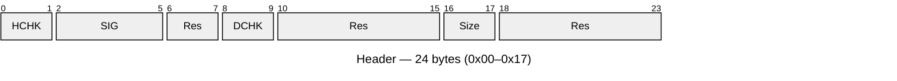

# Binary File Creation

Creates a 1024-byte binary configuration blob for embedded network devices.

> On any error the program prints a message to `stderr`, exits with code `1`, and writes no output file.

## Quick Start

```sh
create_binary_file <MAC1> <MAC2> <SerialNumber> <Major> <Minor>
```

All parameters are required.

**Example:**

```sh
create_binary_file 00157E33AAFF 00157E33AB00 X550008 09 04
```

Output file: `output.bin`

Contents: MAC1=`00:15:7E:33:AA:FF`, MAC2=`00:15:7E:33:AB:00`, version=9.4,
serial number encodes year=2009, month=May, type=Typ2, seq=8.

## Input Parameters

### MAC1 / MAC2

- 12 uppercase hex characters `[0-9A-F]`
- `FFFFFFFFFFFF` is not a valid value
- Example: `00157E33AAFF`

### SerialNumber

7 characters in the format `<Year><Month><Type><NNNN>`:


**Year** (1 char):

| Char | Year | Char | Year |
|------|------|------|------|
| W    | 2008 | M    | 2020 |
| X    | 2009 | N    | 2021 |
| A    | 2010 | P    | 2022 |
| B    | 2011 | R    | 2023 |
| C    | 2012 | S    | 2024 |
| D    | 2013 | T    | 2025 |
| E    | 2014 | U    | 2026 |
| F    | 2015 | V    | 2027 |
| H    | 2016 | W    | 2028 |
| J    | 2017 | X    | 2029 |
| K    | 2018 |      |      |
| L    | 2019 |      |      |

> **Note:** `W` and `X` each encode two years (2008/2028 and 2009/2029).
> The current implementation interprets `W` as 2008 and `X` as 2009;
> 2028/2029 require a spec change.

**Month** (1 char): `1`=Jan `2`=Feb `3`=Mar `4`=Apr `5`=May `6`=Jun `7`=Jul `8`=Aug `9`=Sep `A`=Oct `B`=Nov `C`=Dec

**Device type** (1 char): `4`=Typ1 `5`=Typ2 `6`=Typ3 `7`=Typ4 `8`=Typ5 `9`=Typ6 `A`=Typ7

**Continuous number**: 4 decimal digits `0000`–`9999`

Example: `AA41234` → A=2010, A=Oct, 4=Typ1, seq=1234

### Major / Minor

- 2 decimal digits `[00-99]`
- Example: `09`, `04`

## Output File Layout

Total size: **1024 bytes** = 24-byte header + 1000-byte data area.
All multi-byte values in **big-endian** byte order.

### Header (bytes 0x00–0x17)



| Offset | Size | Field | Description |
|--------|------|-------|-------------|
| 0x00   | 2    | HCHK  | CRC-16/CCITT over header bytes `[0x02..0x17]` |
| 0x02   | 4    | SIG   | Fixed signature `'W' 'R' 'E' 'C'` |
| 0x06   | 2    | Res   | Reserved (`0x00`) |
| 0x08   | 2    | DCHK  | CRC-16/CCITT over entire data area |
| 0x0A   | 6    | Res   | Reserved (`0x00`) |
| 0x10   | 2    | Size  | Number of valid data bytes in the data area (`21`) |
| 0x12   | 6    | Res   | Reserved (`0x00`) |

### Data area (bytes 0x18–0x3FF, offsets relative to 0x18)


| Offset | Size | Field | Description |
|--------|------|-------|-------------|
| 0x00   | 6    | MAC1  | MAC1 bytes |
| 0x06   | 6    | MAC2  | MAC2 bytes |
| 0x0C   | 2    | MAJOR | Major version |
| 0x0E   | 2    | MINOR | Minor version |
| 0x10   | 5    | SN    | Serial number: `[0]` year (year−2000), `[1]` month (1–12), `[2]` device type (1–7), `[3–4]` continuous number (uint16) |
| 0x15   | 975  | Res   | Reserved (`0x00`) |

## Build

**Prerequisites:** `gcc` (Linux/macOS). Windows cross-compilation requires `mingw-w64`
(`sudo apt install gcc-mingw-w64-x86-64` on Ubuntu).

| Command                  | Description                                        |
|--------------------------|----------------------------------------------------|
| `make`                   | Build the Linux binary (`create_binary_file`)      |
| `make windows`           | Cross-compile for Windows                          |
| `make test`              | Build and run unit tests + integration tests       |
| `make integration-test`  | Run integration tests only (binary must be built)  |
| `make clean`             | Remove all build artefacts                         |
